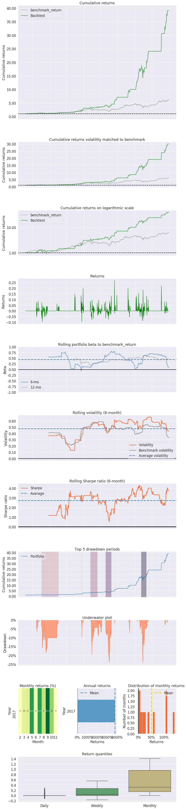

.. _exporting-results-page:

.. |br| raw:: html

    

.. image:: ../media/logo.png
  :width: 100
  :align: center

Exporting Results
=================

.. toctree::
   :maxdepth: 3
   :caption: Contents:

Pyfolio Example
---------------

.. code:: ipython3

    import pyfolio as pf
    %matplotlib inline
    
    # silence warnings
    import warnings
    warnings.filterwarnings('ignore')

.. code:: ipython3

    pf.create_returns_tear_sheet(output['strategy_return'], benchmark_rets=output['benchmark_return'])

Raw Statistics
--------------

.. raw:: html

    <table border="1" class="dataframe">
      <thead>
        <tr style="text-align: right;"><th>Start date</th><td colspan=2>2017-02-15</td></tr>
        <tr style="text-align: right;"><th>End date</th><td colspan=2>2017-11-01</td></tr>
        <tr style="text-align: right;"><th>Total months</th><td colspan=2>36</td></tr>
        <tr style="text-align: right;">
          <th></th>
          <th>Backtest</th>
        </tr>
      </thead>
      <tbody>
        <tr>
          <th>Annual return</th>
          <td>228.9%</td>
        </tr>
        <tr>
          <th>Cumulative returns</th>
          <td>3811.7%</td>
        </tr>
        <tr>
          <th>Annual volatility</th>
          <td>47.9%</td>
        </tr>
        <tr>
          <th>Sharpe ratio</th>
          <td>2.72</td>
        </tr>
        <tr>
          <th>Calmar ratio</th>
          <td>9.38</td>
        </tr>
        <tr>
          <th>Stability</th>
          <td>0.96</td>
        </tr>
        <tr>
          <th>Max drawdown</th>
          <td>-24.4%</td>
        </tr>
        <tr>
          <th>Omega ratio</th>
          <td>2.70</td>
        </tr>
        <tr>
          <th>Sortino ratio</th>
          <td>6.84</td>
        </tr>
        <tr>
          <th>Skew</th>
          <td>NaN</td>
        </tr>
        <tr>
          <th>Kurtosis</th>
          <td>NaN</td>
        </tr>
        <tr>
          <th>Tail ratio</th>
          <td>2.50</td>
        </tr>
        <tr>
          <th>Daily value at risk</th>
          <td>-5.5%</td>
        </tr>
        <tr>
          <th>Alpha</th>
          <td>0.99</td>
        </tr>
        <tr>
          <th>Beta</th>
          <td>0.44</td>
        </tr>
      </tbody>
    </table>

|br| 

Tearsheet Charts
----------------

